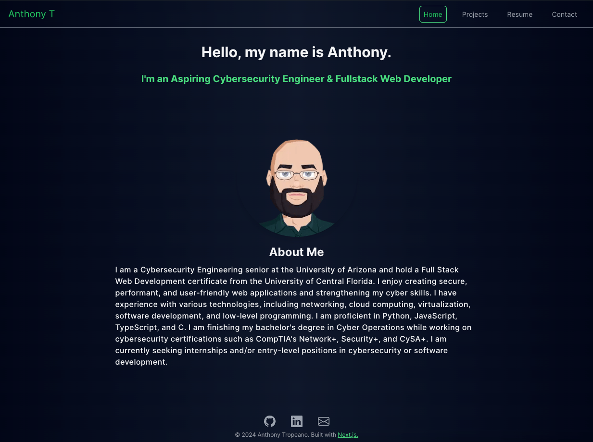

# Hello, my name is Anthony

## I&apos;m a Cybersecurity Engineer & Fullstack Web Developer

Cybersecurity and systems engineer with experience in Linux, networking, virtualization, and automation, along with additional full-stack development work (React/Next.js, Node.js, SQL/NoSQL) and low-level programming in C; currently completing a B.A.S. in Cyber Operations and beginning an M.S. in Computer Science at Dakota State University

## View Portfolio

The portfolio is available at [https://atropeano.com](https://atropeano.com)

## Screenshot

## Tech Stack

| **Tech**             | **Description**                                                   | **Links**                                                                  |
| -------------------- | ----------------------------------------------------------------- | -------------------------------------------------------------------------- |
| React                | A JavaScript library for building user interfaces.                | [React](https://reactjs.org/)                                              |
| TypeScript           | A typed superset of JavaScript that compiles to plain JavaScript. | [TypeScript](https://www.typescriptlang.org/)                              |
| TailwindCSS          | A utility-first CSS framework for rapid UI development.           | [TailwindCSS](https://tailwindcss.com/)                                    |
| NodeJS               | A JavaScript runtime built on Chrome's V8 JavaScript engine.      | [NodeJS](https://nodejs.org/)                                              |
| NextJS               | A React framework for server-rendered applications.               | [NextJS](https://nextjs.org/)                                              |
| EmailJS              | A service to send emails directly from client-side JavaScript.    | [EmailJS](https://www.emailjs.com/)                                        |
| React Google Captcha | A React component for integrating Google reCAPTCHA.               | [React Google Captcha](https://github.com/dozoisch/react-google-recaptcha) |

## License

[MIT LICENSE](./LICENSE)
